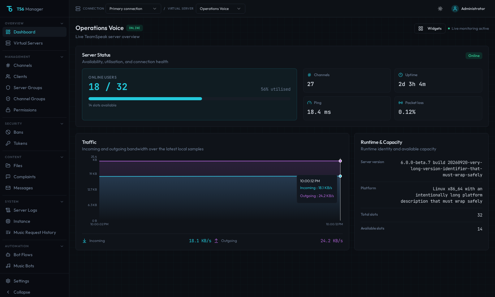
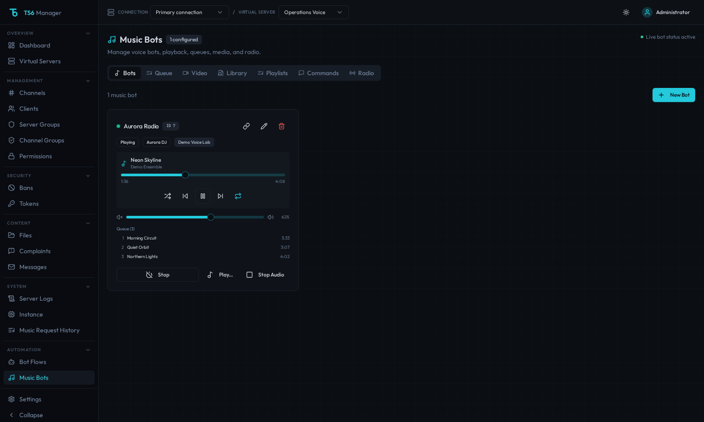
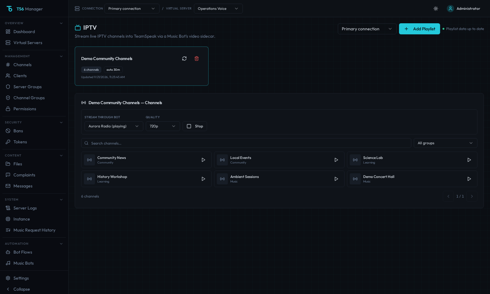
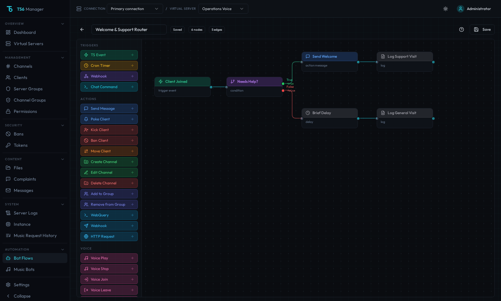
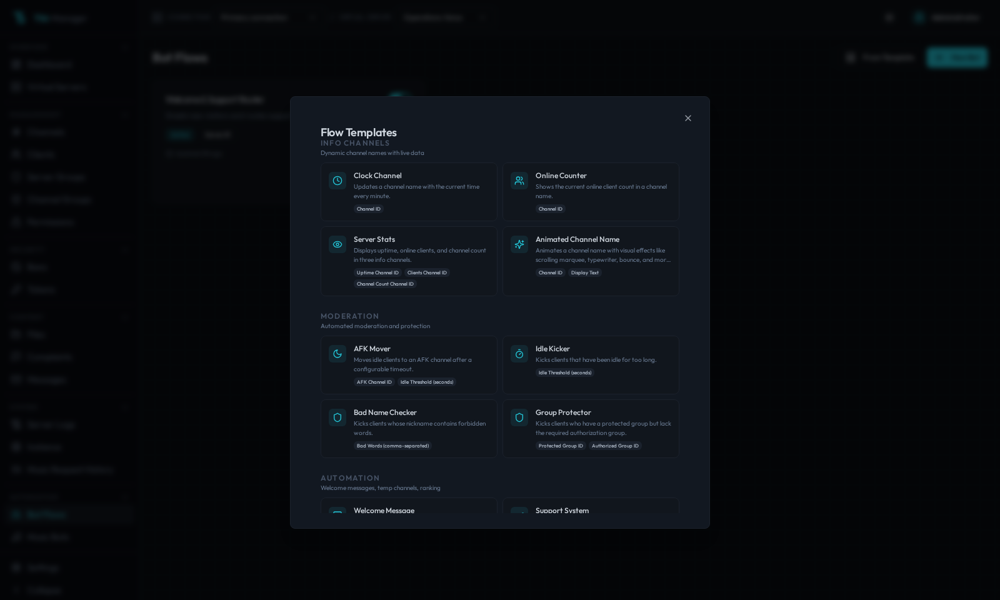
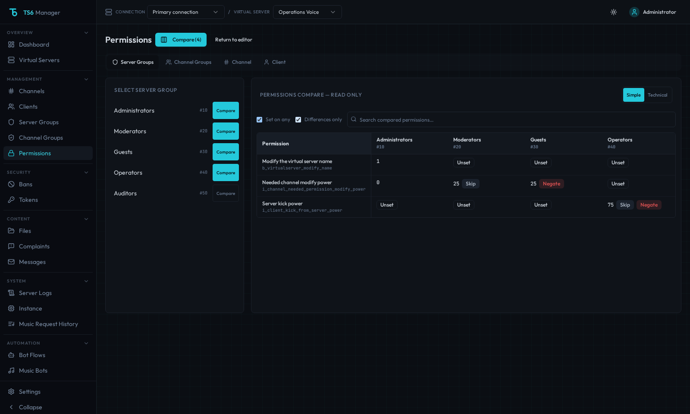

#### DISCLAIMER: 


# TS6 Manager

> [!IMPORTANT]
> **This is an opinionated continuation of [`clusterzx/ts6-manager`](https://github.com/clusterzx/ts6-manager), not a mirror or drop-in republish of upstream.**
> Expect security/reliability-focused changes, selective QoL, and different container images (`ghcr.io/uniskela/ts6-manager/...`).
> Community issue/PR credits: [`CREDITS.md`](CREDITS.md) (including [fork contributions](CREDITS.md#fork-contributions)).

Web-based management interface for TeamSpeak servers. Control virtual servers, channels, clients, permissions, music bots, automated workflows, and embeddable server widgets — all from your browser.

Built on the **WebQuery HTTP API** (the ServerQuery replacement in modern TeamSpeak builds). Telnet is not used or supported.


## Documentation

The maintained public documentation is available at **[uniskela.com/docs/ts6-manager](https://uniskela.com/docs/ts6-manager/)** and is sourced from the reviewed Markdown files in [`docs/`](docs/index.md).

Start with:

- [Installation](docs/installation.md)
- [Configuration](docs/configuration.md)
- [Upgrading](docs/upgrading.md)
- [TeamSpeak compatibility](docs/teamspeak-compatibility.md)
- [Music bots](docs/music-bots.md)
- [Bot flows](docs/bot-flows.md)
- [Security](docs/security.md)
- [Troubleshooting](docs/troubleshooting.md)
## Screenshots

### Dashboard
Live overview of your selected server, organized into Server Status, Traffic, and Runtime & Capacity with current refresh state.



### Music Bots
Run multiple music bots per server. Each bot has its own queue, volume control, and playback state. Supports radio streams, YouTube, and a local music library. Users in the bot's channel can control it via text commands (`!radio`, `!play`, `!vol`, etc.).



### Video Streaming / IPTV
Browse channels from configured M3U/M3U8 playlist URLs and stream a selected channel through a running music bot and the video sidecar.



### Bot Flow Engine
Visual node-based editor for building automated server workflows. Readable orthogonal routes, labelled condition branches, and a canvas sized from the real flow keep larger automations navigable. Unsaved drafts are protected from normal in-app navigation and query refreshes.



### Flow Templates
Get started quickly with pre-built flow templates. Covers common use cases like temporary channel creation, AFK movers, idle kickers, online counters, and group protection. One click to import, then customize to your needs.



### Permissions Compare
Compare two to four entities from the same permission layer in a read-only table. Simple or technical labels and Set on any / Differences only filters make raw values, unset states, Skip, and Negate flags easier to review.



## Features

### Server Management
- Dashboard with Server Status, Traffic, and Runtime & Capacity hierarchy
- Virtual server list with start/stop controls
- Channel tree with drag-and-drop ordering plus touch/keyboard move controls
- Client list with confirmed, pending-safe kick and ban actions plus move and poke
- Server & channel group management
- Permission editor (server, channel, client, group-level) with context-safe drafts, Simple/Technical labels, and read-only same-layer Compare for up to four entities
- Ban list management
- Token / privilege key management
- Complaint viewer
- Offline message system
- Server log viewer with filtering
- Channel file browser with upload/download
- Instance-level settings

### Music Bots
- Multiple bots per server, each with independent queue and playback
- Radio station streaming with ICY metadata and live title updates
- YouTube playback via yt-dlp (search, stream/on-demand playback with download fallback, queue and library downloads)
- Music library management (upload, organize, playlists)
- Local/downloaded tracks are decoded incrementally at media speed so memory use stays bounded on long tracks
- TeamSpeak voice hostnames are resolved once per connection rather than once per UDP packet
- Volume control, pause, skip, previous, shuffle, repeat
- Stereo audio support with stable 20ms pacing
- Auto-reconnect with exponential backoff and overlap protection
- In-channel text commands for hands-free control
- Music request history tracking

### Video Streaming
- Live video streaming from YouTube, Twitch, or direct URLs to TeamSpeak channels
- WebRTC-based with Go sidecar relay (Pion) for low-latency delivery
- Quality presets (480p, 720p, 1080p)
- M3U/M3U8 playlist URL management; administrators can also upload `.m3u`, `.m3u8`, or `.txt` playlist files (see [Video streaming](docs/video-streaming.md)); channel browsing, filtering, and music-bot streaming
- In-browser preview with WebRTC playback
- A/V synchronization via RTCP Sender Reports
- Runs as a Docker sidecar container alongside the backend

### Bot Flow Engine
- Visual flow editor with drag-and-drop nodes, dynamic canvas extents, rounded orthogonal routes, and labelled True/False branches
- Triggers: TS3 events, cron schedules, webhooks (with mandatory secrets), chat commands (global or channel-specific)
- Actions: kick, ban, move, message, poke, channel create/edit/delete, HTTP requests, WebQuery commands, music-bot controls, and utility actions
- Conditions, persistent flow variables, execution-local temporary values, delays, and logging
- Animated channel names (rotating text on a timer)
- Placeholder system with filters and expressions
- Pre-built templates for common automation tasks

### Server Widgets
- Embeddable server status banner for websites and forums
- Token-based public access (no authentication required)
- Available as live page, SVG, or PNG image
- Dark and light themes
- Configurable: show/hide channel tree and client list

### Security
- Setup wizard for initial admin account (no default credentials)
- AES-256-GCM encryption for stored credentials (API keys, SSH passwords)
- SSRF protection on all outbound HTTP requests and FFmpeg URLs
- Rate limiting on authentication endpoints
- JWT access + refresh token rotation with reuse detection
- Role-based access control (admin / viewer)
- Per-server access control for multi-tenant setups
- WebQuery command whitelist in bot flows (blocks destructive commands)
- Authenticated WebSocket connections
- Password complexity requirements
- Production Node images omit npm/npx/pnpm/Corepack and esbuild build tooling; CI rebuilds and Trivy-scans all release images, failing on fixable HIGH/CRITICAL findings

### Settings & Administration
- Browser-local appearance controls with Light, Dark, or Black base themes and Cyan, Violet, Red, Blue, Emerald, or Amber accents
- yt-dlp cookie file management for accessing age-restricted or member-only YouTube content
- Upload cookies via file or paste directly in the UI
- Admin-only settings panel

## Architecture

```
┌──────────────┐     ┌──────────────┐     ┌─────────────────┐
│   Frontend   │────▶│   Backend    │────▶│  TS Server      │
│  React SPA   │     │  Express API │     │  WebQuery HTTP  │
│  nginx :80   │     │  Node :3001  │     │  SSH (events)   │
└──────────────┘     └──────┬───────┘     └─────────────────┘
                            │
                     ┌──────┴───────┐
                     │   SQLite     │
                     │   (Prisma)   │
                     └──────────────┘
                            │
                     ┌──────┴───────┐
                     │   Sidecar    │
                     │  Go/Pion     │
                     │  WebRTC :9800│
                     └──────────────┘

Public:  /widget/:token  ──▶  SVG / PNG / JSON (no auth)
```

**Four packages** in a pnpm monorepo:

| Package | Description |
|---------|-------------|
| `@ts6/common` | Shared types, constants, utilities |
| `@ts6/backend` | Express API, WebQuery client, bot engine, voice bots, widgets |
| `@ts6/frontend` | React SPA with Vite, TailwindCSS, shadcn/ui |
| `sidecar` | Go WebRTC media relay (Pion) for video streaming |

The backend proxies all TeamSpeak API calls. The frontend never has direct access to API keys or server credentials.

## Tech Stack

**Frontend:** React 18, Vite, TailwindCSS, shadcn/ui, TanStack Query + Table, React Flow, Recharts, Zustand

**Backend:** Node.js, Express, Prisma (SQLite), JWT authentication, WebQuery HTTP client, SSH event listener

**Voice/Audio:** Custom TS3 voice protocol client (UDP), Opus encoding, FFmpeg, yt-dlp

**Video Streaming:** Go sidecar with Pion WebRTC v4, RTCP Sender Reports for A/V sync

## Quick Start (Docker)

Prebuilt images are published to **GitHub Container Registry** only for immutable `vX.Y.Z` releases created by Release Please. Ordinary pushes and PR merges to `main` do **not** publish images. [`.github/workflows/publish-images.yml`](.github/workflows/publish-images.yml) is invoked after a release is created and also has a manual recovery path for republishing an existing release tag.

| Service  | Image |
|----------|--------|
| Backend  | `ghcr.io/uniskela/ts6-manager/backend:latest` |
| Frontend | `ghcr.io/uniskela/ts6-manager/frontend:latest` |
| Sidecar  | `ghcr.io/uniskela/ts6-manager/sidecar:latest` |
| All-in-one | `ghcr.io/uniskela/ts6-manager/all-in-one:latest` |

Pull without logging in once the packages are **Public** (Packages → each image → Package settings). The workflow tries to set that automatically after the first publish.

### Split stack (default)

1. Download the [`docker-compose.yml`](docker-compose.yml)
2. Create a `.env` file next to it:

```env
JWT_SECRET=your-random-secret-at-least-32-characters
ENCRYPTION_KEY=another-random-secret-for-credential-encryption
SIDECAR_SECRET=shared-secret-between-backend-and-sidecar
```

Generate secure values:

```bash
echo "JWT_SECRET=$(openssl rand -base64 32)" >> .env
echo "ENCRYPTION_KEY=$(openssl rand -base64 32)" >> .env
echo "SIDECAR_SECRET=$(openssl rand -base64 32)" >> .env
```

3. Start the stack:

```bash
docker compose up -d
```

4. Open `http://localhost:3000/setup` and create your admin account
5. Log in, then add your TeamSpeak server connection under **Settings → Connections** (host, WebQuery port, API key)

> `JWT_SECRET`, `ENCRYPTION_KEY`, and `SIDECAR_SECRET` are **required** in production. The backend refuses to start without them when `NODE_ENV=production`.
> The sidecar HTTP API is authenticated with `SIDECAR_SECRET` and is not published to the host by default.

### Connection credentials and upgrades

WebQuery API keys and SSH passwords are encrypted before they are stored in the persistent SQLite database. Normal container restarts and image upgrades therefore do **not** require you to re-enter connection credentials, provided the database volume and encryption key are preserved.

- Generate `ENCRYPTION_KEY` once and keep the same value across restarts, upgrades, and redeployments. Changing it prevents TS6 Manager from decrypting credentials that were stored with the previous key.
- When creating a WebQuery API key manually, include `lifetime=0` if you want a persistent key (for example, `apikeyadd scope=manage lifetime=0 ip=0.0.0.0/0`). Omitting `lifetime` can create a time-limited key that later starts returning `invalid apikey`.
- When editing an existing connection, secret inputs such as the WebQuery API key or SSH password are intentionally not populated back into the browser. Leaving one of those fields blank keeps the saved encrypted value unchanged.
- On startup, TS6 Manager validates restored WebQuery credentials in the background without delaying the WebUI. A log message such as `invalid apikey` means the TeamSpeak server rejected the saved key; it does not mean TS6 Manager forgot or cleared it.
- Transient SSH closes during the initial handshake are retried automatically. Authentication and host-key failures remain fatal and require the connection settings or server trust configuration to be corrected.

### All-in-one (single container)

Runs nginx + backend + sidecar in one image (adapted from upstream [PR #64](https://github.com/clusterzx/ts6-manager/pull/64) by [@joaobosconff](https://github.com/joaobosconff)):

```bash
# Same .env secrets as above
docker compose -f docker-compose.all-in-one.yml up -d
# or: docker pull ghcr.io/uniskela/ts6-manager/all-in-one:latest
```

Open `http://localhost:3000` (override with `HOST_PORT`). Only port 80 is published; backend and sidecar stay on loopback inside the container.

### Building from Source

**Full local stack with TeamSpeak 6 (beta13)** — preferred happy path:

```bash
git clone https://github.com/uniskela/ts6-manager.git
cd ts6-manager
cp .env.pr-test.example .env
docker compose -f docker-compose.pr-test.yml up --build
```

Then open `http://localhost:3000/setup`, create the first admin, and log in. The bundled TeamSpeak connection is already present (WebQuery + SSH Query). Demo mode remains available separately.

**Manager only (no TeamSpeak):** use `docker compose -f docker-compose.local.yml up -d --build` after writing `JWT_SECRET`, `ENCRYPTION_KEY`, and `SIDECAR_SECRET` into `.env`.

> This repository is an opinionated continuation of the original [`clusterzx/ts6-manager`](https://github.com/clusterzx/ts6-manager) project.

### Coolify / Reverse Proxy

Use [`docker-compose.coolify.yml`](docker-compose.coolify.yml) as a starting point. Key differences from the standard compose:

- No `ports` section — the reverse proxy handles routing
- Set the domain on the **frontend** service in Coolify (port 80)
- If your TS server runs in a separate Docker network, add it as an external network on the backend service:

```yaml
services:
  backend:
    networks:
      - ts6-network
      - ts-server-net

networks:
  ts-server-net:
    external: true
    name: your-ts-server-network-id
```

## Development

Requires: Node.js 20+ and **pnpm 9.x**. CI deliberately uses pnpm 9; newer pnpm majors change dependency build-script/override handling and are not the supported local baseline yet.

For a reproducible local setup with Corepack:

```bash
corepack enable
corepack prepare pnpm@9.15.9 --activate
pnpm install --frozen-lockfile
pnpm db:generate
pnpm dev          # starts backend + frontend in parallel
```

Backend runs on `:3001`, frontend on `:5173` (Vite dev server).

### Database

Prisma with SQLite. On first run (local development):

```bash
cd packages/backend
npx prisma db push
npx prisma db seed
```

**Docker Compose upgrades:** every backend start runs [`docker-commands/apply-schema.sh`](docker-commands/apply-schema.sh). If the persistent `backend-data` volume already has a database (including installs from older images with no version marker), the script logs an upgrade, runs `prisma db push` to bring the schema current, seeds if needed, and records `packages/backend/prisma/SCHEMA_VERSION` under `data/.schema-version`. No manual migrate step is required for `docker compose up` after pulling a new image — bump `SCHEMA_VERSION` whenever the Prisma schema changes so upgrade logs stay accurate.

## Environment Variables

| Variable | Default | Description |
|----------|---------|-------------|
| `JWT_SECRET` | — | **Required.** Secret for JWT signing. Must be set in production. |
| `ENCRYPTION_KEY` | — | **Required in production.** Dedicated AES-256-GCM key for stored credentials. Generate it once and keep the same value across restarts/upgrades; dev may fall back to `JWT_SECRET`. |
| `PORT` | `3001` | Backend port |
| `DATABASE_URL` | `file:./data/ts6webui.db` | SQLite database path |
| `JWT_ACCESS_EXPIRY` | `15m` | Access token lifetime |
| `JWT_REFRESH_EXPIRY` | `7d` | Refresh token lifetime |
| `FRONTEND_URL` | `http://localhost:3000` | CORS origin |
| `MUSIC_DIR` | `/data/music` | Directory for downloaded music files |
| `SIDECAR_URL` | — | Optional. Full URL of the WebRTC sidecar service (e.g. `http://ts6-sidecar:9800`). Set in Docker when sidecar runs as a separate container. |
| `SIDECAR_SECRET` | — | **Required when `SIDECAR_URL` is set in production.** Shared bearer token for sidecar mutating APIs. |
| `YT_COOKIE_FILE` | — | Optional. Path to a Netscape-format cookies.txt file for yt-dlp. Can also be managed via **Settings → YouTube** in the UI. |

## Environment Variables: Sidecar / Video Streaming

Defaults below are the **sidecar code defaults**. Compose files may intentionally override them (for example, the standard split-stack compose raises the RTP queue sizes).

| Variable | Default | Description |
|----------|---------|-------------|
| `VIDEO_QUEUE_SIZE` | `1024` | Size of the video RTP queue |
| `AUDIO_QUEUE_SIZE` | `2048` | Size of the audio RTP queue |
| `SYNC_PLAYOUT_BUFFER_MS` | `50` | Small playout buffer used by the adaptive pacing logic |
| `SYNC_VIDEO_BIAS_MS` | `0` | Optional extra holdback for video to fine-tune sync |
| `SYNC_MAX_DELAY_MS` | `500` | Maximum pacing delay / latency sample used by the sync clamp |
| `AUDIO_DELAY_MS` | `0` | Optional manual audio delay; normally leave at `0` with adaptive pacing |
| `SIDECAR_DEBUG_LOGS` | `0` | Set to `1` to enable verbose high-frequency runtime logs |
| `VIDEO_RTP_READ_BUFFER` | `4194304` | Requested UDP socket read buffer for video RTP |
| `AUDIO_RTP_READ_BUFFER` | `1048576` | Requested UDP socket read buffer for audio RTP |
| `VIDEO_WIDTH` | `1280` | Default output width when not supplied by the API |
| `VIDEO_HEIGHT` | `720` | Default output height when not supplied by the API |
| `VIDEO_FRAMERATE` | `30` | Default output frame rate when not supplied by the API |
| `VIDEO_BITRATE` | `1500k` | Default VP8 target bitrate |
| `AUDIO_BITRATE` | `128k` | Default Opus target bitrate |
| `VIDEO_CPU_USED` | `4` | libvpx realtime speed/quality trade-off |
| `VIDEO_ENCODE_THREADS` | CPU count | libvpx encode thread count |
| `VIDEO_BUFSIZE` | auto | Optional override; otherwise approximately `2 × VIDEO_BITRATE` |

## Music Bot Text Commands

When a music bot is connected to a configured command channel, users there can control it via chat. These are the built-in commands; custom commands (and recommended presets like `!rules` / `!links`) can also be configured under Music Bots → Commands.

- **`!help`** — Show built-in and custom commands
- **`!commands`** — List enabled custom chat commands
- **`!play <url>`** — Play YouTube, Spotify, or Apple Music media
- **`!play`** — Resume paused playback
- **`!queue [show|clear|remove <n>|play <n>|<url>]`** — Show or manage the queue using one-based positions
- **`!add <url>`** — Alias for `!queue <url>`
- **`!playlist [name-or-id]` / `!pl <name-or-id>`** — List or append a saved playlist; an idle connected bot resumes queue order
- **`!repeat [off|track|queue]`** — Show or set repeat mode
- **`!seek <seconds|+seconds|-seconds>`** — Seek within a local/downloaded track
- **`!remove <text>`** — Remove one unambiguous upcoming title/artist match
- **`!shuffle [on|off]`** — Toggle or set shuffle
- **`!stop`** — Stop playback
- **`!pause`** — Toggle pause/resume
- **`!skip` / `!next`** — Next track in queue
- **`!prev`** — Previous track
- **`!vol [0-100]` / `!volume [0-100]`** — Show or set volume
- **`!np` / `!nowplaying`** — Show the current track
- **`!radio [id]`** — List or play radio stations
- **`!stream <url>`** — Start a video stream
- **`!stopstream`** — Stop the active video stream
- **`!viewers`** — List stream viewers
- **`!channels [search]`** — List/search IPTV channels
- **`!tv <name>` / `!iptv <name>`** — Stream an IPTV channel
- **`!lyrics [artist - title]`** — Show lyrics for the current track or search

## Requirements

- TeamSpeak server with **WebQuery HTTP** enabled (not raw/telnet)
- WebQuery API key (generated via `apikeyadd` or server admin tools)
- SSH ServerQuery access to the TS server when using the file browser, bot flow event triggers, or music-bot channel chat commands
- `yt-dlp` and `ffmpeg` installed on the backend (included in the Docker image)

## TeamSpeak compatibility and beta13 setup

Tested TeamSpeak Server: **6.0.0-beta13** (official image
`teamspeaksystems/teamspeak6-server:6.0.0-beta13`). Older versions are not
intentionally excluded; the manual key method below remains available.

Configure these on the **TeamSpeak server/container**, not the TS6 Manager container:

```env
TSSERVER_QUERY_HTTP_ENABLED=1
TSSERVER_QUERY_HTTP_ALLOW_GUEST=0
TSSERVER_QUERY_SSH_ALLOW_GUEST=0
TSSERVER_QUERY_ADMIN_API_KEY=<secure-stable-key>
```

Beta13 enables guest HTTP/SSH Query access by default. For administrative deployments,
we recommend explicitly disabling it: TS6 Manager requires authenticated WebQuery
and uses optional authenticated SSH. Guest access can remain enabled when you
intentionally want to expose the Guest Server Query permissions; it is not needed
by this application. Restrict Query ports to trusted management networks.

On beta13+ Docker, `TSSERVER_QUERY_ADMIN_API_KEY` is the simplest deterministic way
to provision the built-in `serveradmin` management key. Generate a strong key and
keep it stable. **Changing it replaces the relevant built-in serveradmin management
API key.** The previously encrypted key in TS6 Manager then stops authenticating;
update the API key in the saved connection. Do not log or share the value. TS6
Manager continues to store connection secrets encrypted; keys remain mandatory.

Alternatively, including on older servers, connect using authenticated SSH Query:

```text
use 1
apikeyadd scope=manage lifetime=0 ip=0.0.0.0/0
```

`lifetime=0` makes the key non-expiring. Narrow the allowed source IP range where
practical. The bootstrap and manual methods are alternatives, not two required steps.

Beta13 also offers **optional external Prometheus monitoring**. Metrics are disabled
by default (`TSSERVER_METRICS_ENABLED=0`); the default port is `9187`. The endpoint
is unauthenticated. Bind it to a restricted interface (`TSSERVER_METRICS_IP`) and
apply firewall/network restrictions rather than exposing it publicly. Per-packet
voice diagnostics (`TSSERVER_METRICS_VOICE`) add overhead: benchmark before enabling
on busy production servers. TS6 Manager neither scrapes nor proxies these metrics.

Server logs default to UTC in beta13. Administrators can select `utc` or `local`
using `TSSERVER_LOG_TIMEZONE`. TS6 Manager displays raw log text without converting
its timestamps.

The separate [compatibility workflow](.github/workflows/ts6-compat.yml) runs manually, weekly, and on PRs changing the smoke test or WebQuery client, with an image-tag input for future betas. It starts an isolated official
server with an ephemeral admin key and guest Query disabled, waits for an online
virtual server, rejects unauthenticated HTTP access, and exercises the real
`WebQueryClient`: `version`, `serverinfo`, `clientlist`, `channellist` and
`serverrequestconnectioninfo`, plus a channel create/info/non-forced delete round-trip.
It does not certify voice/video playback, public YouTube availability, SSH/file
transfers, production networking, or every server configuration. It is separate
from fast PR validation.

## Download progress

Explicit library downloads (single, selected batch, and playlist “download selected”)
show current/total items, real yt-dlp percentage, speed, ETA and processing state.
Jobs run in the background; polling stops on completion/failure or component unmount.
Progress endpoints require application authentication, admin permissions, and matching
server and requesting user. Jobs are in memory, capped at 100 retained / four active,
and expire after ten minutes without updates or thirty minutes total. A backend
restart loses progress history. Stream-playlist registration retains its existing
semantics and does not download media eagerly.

### Bundled yt-dlp lifecycle

Production containers do not self-update packages. yt-dlp is installed at image
build time using pip’s required PEP-668 option; builds check `yt-dlp --version`,
`ffmpeg -version` and `node --version`. Pull a newly built TS6 Manager image and
recreate the container to refresh bundled yt-dlp. Rebuilding with a fresh image
build also refreshes it. No in-app package updater is provided. Extractor tests use
structured fixtures; a public-video smoke test is deliberately not a release gate
because availability, rate limits and regional restrictions are outside our control.

## License

MIT
