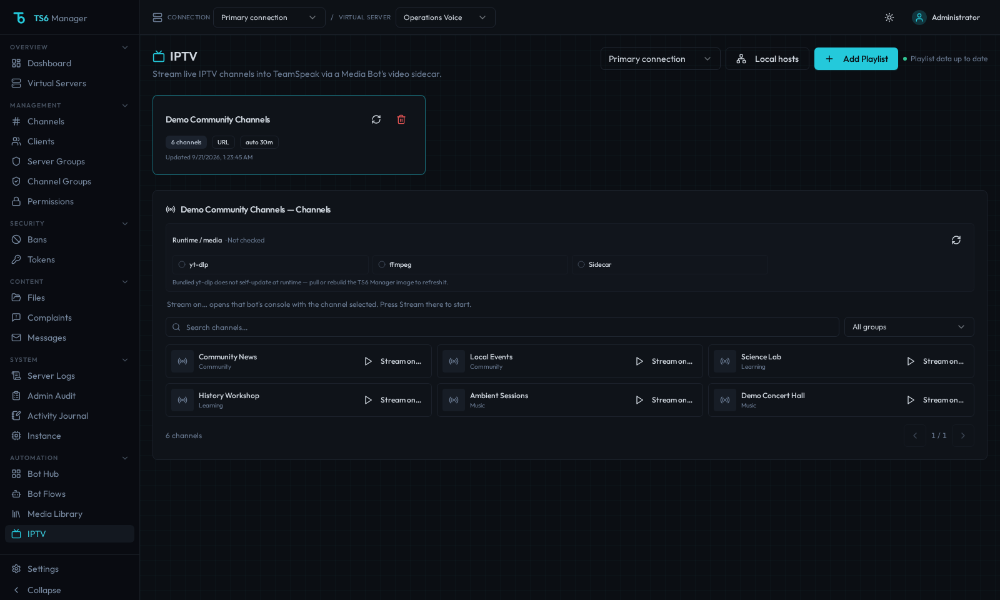

# Video streaming

TS6 Manager includes a Go/Pion media sidecar for low-latency video delivery to TeamSpeak clients and the browser preview.

## Starting from the console

Open **Bot Hub**, then **Open console** on the bot you want to use. If it is offline, press **Start bot** first. The console's **Play something** panel has **Music · Link · Radio · IPTV** source tabs; **Now playing** shows the active session and offers **Stop stream** while video or IPTV is running.

For a video URL, open **Link**, paste the source, choose **Stream as video**, then press **Stream as video**. The folded **Video options** row shows what the stream will use; open it to change **Quality**, **Encoder**, **Stop with no viewers after**, and **Source type** for that start only. Quality starts on **Use bot default**, which uses the bot's saved stream preset. Encoder and the no-viewer stop start on **Use server default**, with the current setting shown in parentheses. These come from **Media Library → Streaming defaults**, or from `VIDEO_ENCODER` and `VIDEO_NO_VIEWER_TIMEOUT_SECONDS` when nothing is saved there. The server resolves inherited settings when the stream starts. Choose **Auto** explicitly for automatic quality or encoder selection, or select another value for this stream; selecting the default option again restores inheritance. A URL can also use **Play as music** to play its audio.

To stream a file already under `MUSIC_DIR`, enter its plain filename in **Link**, for example `clip.mp4`, then press **Stream**. Files outside the music folder are rejected. A filename selects **Stream as video** and disables **Play as music**; use the **Music** tab to play a music-folder file as audio.

Opening a console or following an IPTV link only selects a source; press **Stream** to start it.

## Supported inputs

The streaming path can accept supported YouTube, Twitch, direct media URLs, local video files, and IPTV sources.

- **YouTube** is downloaded with yt-dlp to a short-lived file under the music directory (avoids googlevideo 403s from datacenter IPs), then encoded.
- **YouTube, streamed directly** (optional): with *Settings → YouTube → Stream YouTube videos directly* on, a YouTube video is not downloaded. yt-dlp resolves its media URLs and ffmpeg reads them as it plays, so a stream starts in seconds whatever the video's length, and live broadcasts work. Above 720p, and for some live broadcasts, YouTube delivers video and audio as two streams, which the sidecar reads as two inputs. *Max video duration* is not applied in this mode, since nothing is stored; the no-viewer timeout still ends an unwatched stream. Auto quality takes the picture size from yt-dlp, so there is no probe. It is off by default because YouTube refuses direct playback from some networks (the 403s above); if streams fail to start with it on, turn it off. The media URLs expire after some hours, which ends a stream that runs that long.
- **Twitch** (live or VOD) is resolved with yt-dlp to a direct media URL and fed to ffmpeg — it is not downloaded to a `.stream-*.mp4` temp file (live Twitch cannot finish that path).

## Quality

Pick **Auto** or a fixed preset: 480p, 720p, 1080p, 1440p or 2160p.

Streaming defaults also offer **Performance / Balanced / Quality** profiles (default Balanced): they set Auto limit, bitrate clamp, and software encode speed (`cpu-used`). Open **Advanced quality settings** for manual Auto limit, bitrate, encode speed, and encoder knobs.

- **Auto** probes the source with `ffprobe` and uses the largest preset the source fits without upscaling, up to the **Auto limit** (default 1080p under Balanced). A 720p channel stays 720p even when the limit is 2160p. If the probe fails, Auto uses 720p (or the limit, if lower) and says so.
- **Fixed presets** skip the probe. Prefer them for IPTV services that allow only one connection, since the probe is a second one.
- The stream panel shows *requested → actual*, e.g. `Auto → 1080p (source 1920×1080)`.
- Leave the bitrate empty to use the preset's bitrate. Admins can set a **bitrate limit** that clamps every stream.
- Every stream is capped at **9500 kbps**, whatever the preset, custom bitrate or limit says: TeamSpeak drops a stream above 10 Mbit/s, which would look like an encoder failure. 2160p therefore uses 9500 kbps.
- Software VP8 and VP9 are held at the target bitrate (`-minrate`); without it libvpx overshoots on detailed video.

1440p and 2160p need a fast CPU with software encoders; a hardware encoder is recommended.

## Encoders

| Encoder | Codec | Notes |
|---|---|---|
| VP8 (software) | VP8 | Default; `libvpx` realtime |
| VP9 (software) | VP9 | `libvpx-vp9` realtime |
| H.264 (software) | H.264 | `libx264`, offered as **Constrained High** — the only H.264 profile the TeamSpeak client renders |
| VP8 / VP9 / H.264 (VAAPI) | same | GPU encode through VAAPI; H.264 uses Constrained High as well |
| H.264 (NVENC) | H.264 | GPU encode on NVIDIA; Constrained High. NVIDIA has no VP8 or VP9 encoder |
| H.264 (AMF) | H.264 | AMD GPU encode with a native Windows sidecar and AMF-enabled FFmpeg; explicitly requests Constrained High (`-profile:v constrained_high`) with no B frames for TeamSpeak |

**Auto** uses software VP8, unless *Auto prefers hardware* is enabled: then it uses the first hardware encoder (H.264 on VAAPI, H.264 on NVENC, H.264 on AMF, then VP9 and VP8 on VAAPI) that passed the sidecar's test encode.

If a hardware encoder cannot open the device or exits during startup, the sidecar restarts with the software encoder **of the same codec** (so connected viewers keep working) and the stream panel shows the fallback and its reason. Use **Check encoders** under *Streaming defaults* to run the test encodes on demand; routine status polling never runs them.

### Enabling VAAPI (Intel / AMD GPUs)

1. Pass the render node through to the sidecar container, for example in `docker-compose.yml`:

   ```yaml
   sidecar:
     devices:
       - /dev/dri:/dev/dri
   ```

2. The sidecar and all-in-one images include Mesa's VAAPI driver (`mesa-va-drivers`, AMD and older Intel) and, on amd64, Intel's `intel-media-va-driver`. For the all-in-one image, pass `/dev/dri` to that container instead.
3. Open *Streaming defaults* → **Check encoders** and confirm the VAAPI rows pass. Set `VAAPI_DEVICE` if your render node is not `/dev/dri/renderD128`.
4. Optionally set `VIDEO_HW_DECODE=1` to decode on the GPU too. The decoded frames then stay on the GPU: they are scaled with `scale_vaapi` and go straight to the encoder, with no copy through system memory. That is the fast path: on an Intel Pentium Gold 8505 (UHD Graphics), 4K60 VP9 to 1080p ran at about 6× real time and 65 % sidecar CPU, against 3× and 384 % when decoding on the CPU (the default). A source the GPU cannot decode still streams; it is decoded on the CPU and uploaded. There is no padding on this path: a source that is not 16:9 keeps its own shape inside the preset (a 4:3 source as 1440×1080 at 1080p), and the TeamSpeak client draws the bars. `VIDEO_GPU_FILTERS=0` turns it off.

### Enabling NVENC (NVIDIA GPUs)

1. Install the NVIDIA driver and the NVIDIA Container Toolkit on the host (`nvidia-container-toolkit`, then `nvidia-ctk runtime configure --runtime=docker`).
2. Start the stack with the NVIDIA override, which reserves the GPU for the sidecar and sets `NVIDIA_DRIVER_CAPABILITIES=compute,video,utility` (`video` is what loads the encoder):

   ```bash
   docker compose -f docker-compose.yml -f docker-compose.nvidia.yml up -d
   ```

   The image needs nothing extra: its FFmpeg already includes `h264_nvenc`.
3. Open *Streaming defaults* → **Check encoders** and confirm the **H.264 (NVENC)** row passes. Select it, or leave the encoder on Auto with *Auto prefers hardware* on.
4. Optionally set `VIDEO_HW_DECODE=1` on the sidecar to decode on the GPU too (`-hwaccel cuda`).

NVENC encodes H.264 only. The preset is `p4` with the low-latency tune; `VIDEO_NVENC_PRESET` changes the preset. When the host has no NVIDIA GPU or container runtime, **Check encoders** shows **NVIDIA GPU/runtime not present** on that row instead of ffmpeg's generic parameter hint. A summarized ffmpeg error stays under **ffmpeg output**.

### AMD AMF (Windows)

AMF is a supported production encoder when the media sidecar runs **natively on Windows**, with a compatible AMD GPU/driver and an AMF-enabled Windows FFmpeg build. The Linux Docker sidecar cannot use Windows AMF directly. VAAPI requires `/dev/dri`; NVENC needs a working NVIDIA driver (and NVIDIA container runtime when containerized); AMF needs neither. Windows-native NVENC and software encoders remain available when that FFmpeg build and hardware support them. On hosts without AMF, its test encode fails normally and Auto can choose another encoder.

Download a Windows FFmpeg build with AMF support from a provider listed on the [FFmpeg download page](https://ffmpeg.org/download.html#build-windows), extract it, and add the directory containing `ffmpeg.exe` and its companion `ffprobe.exe` to `PATH` (or configure their full paths below). Use a compatible AMD Windows graphics driver. Verify in PowerShell:

```powershell
ffmpeg -hide_banner -encoders | Select-String "amf"
```

The output must include `h264_amf`. AV1/HEVC AMF encoders may also be present, but TS6 Manager currently selects only H.264 AMF. The capability check performs a real small encode; an encoder appearing in this list alone does not prove the driver can initialize it.

Native Windows production deployments currently build the sidecar from source. TODO: publish automated Windows release artifacts separately. This is the normal cross-platform media sidecar; AMF is one runtime capability.

#### Breaking change for source builds

The minimum Go toolchain version for sidecar source builds has increased from Go 1.25 to Go 1.26.9. Native Windows source builds require Go 1.26.9 or newer; upgrade your Go toolchain before following the build steps below.

Build the sidecar from the same checkout/release as the backend, using Go 1.26.9 or newer. From the repository root:

```powershell
New-Item -ItemType Directory -Force .\bin | Out-Null
Push-Location .\packages\sidecar
try {
    go build -o ..\..\bin\sidecar.exe .
    if ($LASTEXITCODE -ne 0) { throw "Sidecar build failed" }
} finally { Pop-Location }
```

Configure a strong `SIDECAR_SECRET` in the backend environment and pass exactly the same value to the Windows process. The following example reads only that entry from a local `.env` file without printing it (supports the simple unquoted or quoted values used by the example). Supply secrets through your service environment/secret store for unattended production operation:

```powershell
$secretLine = Get-Content -LiteralPath .\.env |
    Where-Object { $_ -match '^\s*SIDECAR_SECRET\s*=' } |
    Select-Object -Last 1
if (-not $secretLine) { throw "SIDECAR_SECRET is MISSING in .env" }
$env:SIDECAR_SECRET = ($secretLine -split '=', 2)[1].Trim().Trim('"').Trim("'")
if (-not $env:SIDECAR_SECRET) { throw "SIDECAR_SECRET is MISSING in .env" }
Remove-Variable secretLine

$env:SIDECAR_PORT = "9800"
$env:FFMPEG_PATH = (Get-Command ffmpeg -ErrorAction Stop).Source
$env:FFPROBE_PATH = (Get-Command ffprobe -ErrorAction Stop).Source
# Choose a persistent Windows directory containing the backend's shared files.
New-Item -ItemType Directory -Force .\media | Out-Null
$env:MUSIC_DIR = (Resolve-Path .\media).Path
$env:WEBRTC_UDP_PORT = "10000"
$env:WEBRTC_NAT1TO1_IP = "127.0.0.1" # Browser preview on this Windows host only.
.\bin\sidecar.exe
```

For TeamSpeak viewers, or browsers on another machine, replace the advertised IP with the Windows host's **reachable LAN or Tailscale IPv4** before starting the sidecar. You may advertise both `127.0.0.1` and that IPv4 as a comma-separated list. The TeamSpeak client does not use loopback even on the same machine. `WEBRTC_UDP_PORT` is owned by the native process; it requires no Docker mapping, and the Docker-only `WEBRTC_BIND_IP` setting does not apply.

Set the backend's `SIDECAR_URL` to the Windows host's private HTTP address. A Docker Desktop backend on the same Windows machine uses `http://host.docker.internal:9800`; a backend on another machine uses a reachable private LAN/Tailscale address instead. Keep the HTTP API private and trusted: the native HTTP listener and fixed UDP mux listen on all interfaces. Windows Firewall must allow TCP `9800` **only from the backend's trusted address/network** (including the Docker Desktop path when used), and UDP `10000` from intended viewers. Do not expose TCP `9800` to the public Internet; its mutating endpoints require the shared bearer secret, but health/status endpoints are not a substitute for network isolation. Use a private encrypted network or HTTPS reverse proxy when the backend is across machines. Do not disable the firewall to troubleshoot connectivity.

Local video files and downloaded clips must be accessible to both processes. Mount the Windows media directory into the backend at its `MUSIC_DIR` (for example `/data/music`) and set the sidecar's `MUSIC_DIR` to the Windows path to those **same files**. The backend sends a portable `music://filename` reference for local sources under its music root; the sidecar resolves it under its own root and rejects traversal. Existing absolute paths remain supported for deployments sharing one path, and HTTP/HTTPS media URLs are unchanged. A shared directory is still required: the reference does not transfer file contents.

In a second PowerShell window, verify health and then open **Streaming defaults → Check encoders**. **H.264 (AMF)** should show available and hardware; its FFmpeg diagnostics remain visible on failure. Select AMF explicitly, or enable **Auto prefers hardware**. AMF uses software decoding, NV12 frames in system memory, explicitly requests H.264 Constrained High (`-profile:v constrained_high`) and disables B frames. AMF's plain High profile is a separate setting; disabling B frames alone does not select Constrained High. `VIDEO_HW_DECODE` currently applies only to VAAPI/NVENC. Software fallback stays H.264 (`libx264`).

```powershell
Invoke-RestMethod http://localhost:9800/health
# For the PR-test container; adapt the container name for your deployment:
docker exec ts6-pr-backend curl -fsS http://host.docker.internal:9800/health
```

### Windows AMF PR-test

The dedicated `docker-compose.pr-test.windows-amf.yml` builds **TeamSpeak, backend and frontend only**. Run it alone, rather than combining it with the normal PR-test compose, which still runs a Linux Docker sidecar for software/VAAPI/NVENC testing. Both harnesses use the same container names and persistent data volumes; stop the other harness before switching.

Requirements: Docker Desktop with Linux containers, Go, Windows FFmpeg/ffprobe, and the checkout containing this feature. From the repository root in PowerShell:

```powershell
# Once, if .env does not already exist; this contains disposable test secrets.
if (-not (Test-Path .\.env)) { Copy-Item .\.env.pr-test.example .\.env }
New-Item -ItemType Directory -Force .\bin, .\.pr-test\music | Out-Null
Push-Location .\packages\sidecar
try {
    go build -o ..\..\bin\sidecar.exe .
    if ($LASTEXITCODE -ne 0) { throw "Sidecar build failed" }
} finally { Pop-Location }

$secretLine = Get-Content -LiteralPath .\.env |
    Where-Object { $_ -match '^\s*SIDECAR_SECRET\s*=' } |
    Select-Object -Last 1
if (-not $secretLine) { throw "SIDECAR_SECRET is MISSING in .env" }
$env:SIDECAR_SECRET = ($secretLine -split '=', 2)[1].Trim().Trim('"').Trim("'")
if (-not $env:SIDECAR_SECRET) { throw "SIDECAR_SECRET is MISSING in .env" }
Remove-Variable secretLine
$env:SIDECAR_PORT = "9800"
$env:FFMPEG_PATH = (Get-Command ffmpeg -ErrorAction Stop).Source
$env:FFPROBE_PATH = (Get-Command ffprobe -ErrorAction Stop).Source
$env:MUSIC_DIR = (Resolve-Path .\.pr-test\music).Path
$env:WEBRTC_UDP_PORT = "10000"
$env:WEBRTC_NAT1TO1_IP = "127.0.0.1" # Add reachable LAN/Tailscale IPv4 for TeamSpeak.
.\bin\sidecar.exe
```

Keep this terminal running. In a second PowerShell window at the repository root:

```powershell
docker compose -f docker-compose.pr-test.windows-amf.yml up --build -d
Invoke-RestMethod http://localhost:9800/health
docker exec ts6-pr-backend curl -fsS http://host.docker.internal:9800/health
```

Open `http://localhost:3000/setup`, create an admin and log in. The bundled TeamSpeak connection is seeded as in the normal PR test. Under **Media Library → Streaming defaults**, run **Check encoders**, then select **H.264 (AMF)** or Auto with hardware preference. Test a downloaded video and a file copied into `.pr-test/music`; the backend sees `/data/music` while the native sidecar sees the Windows directory. Use a reachable advertised IPv4 and the restricted UDP firewall allowance described above when testing TeamSpeak viewing. All Docker published ports in this harness bind `127.0.0.1`; no Docker service publishes UDP `10000` or HTTP `9800`.

Stop the stack with `docker compose -f docker-compose.pr-test.windows-amf.yml down`, then stop the native sidecar with Ctrl+C. Downloaded/local media in `.pr-test/music` persists independently of Docker named volumes.

## Source type and stream health

Every stream has a source type:

| Type | Used for | Behaviour |
|---|---|---|
| **Live** | IPTV channels (default), live URLs | never loops; if it stops, the stream stops as *source unreachable* |
| **On demand** | remote videos | paced playback; stops as *source ended* when it finishes |
| **Local file** | files under the music directory, downloaded clips | paced; admin backgrounds loop |

**Detect** (the default for URLs) uses the Auto-quality probe: a source without a duration is live. The URL itself (for example `.m3u8`) is never used to guess, because IPTV providers often use opaque URLs. With a fixed preset there is no probe, so a URL is treated as on demand unless you pick **Live**.

While a stream runs, the backend samples the sidecar's encode stats every 10 seconds (in-memory counters, not a diagnostic probe). The stream panel and Bot Hub show the source type and encode speed (for example `1.01x · 30 fps`). If encoding stays below 0.9x for 20 seconds after a 15-second startup grace, a warning names the speed, dropped packets, preset, encoder and source type — for example *Encoding below realtime (0.62x for 40 s) at 1080p with VP8 (software) from a live source*. Use a lower preset or a hardware encoder.

If ffmpeg stops on its own, the stream stops instead of showing a frozen picture, with a reason: *source ended*, *source unreachable* (network/HTTP errors, or a live source ending), or *encoder failure*.

### Volume

The bot has one volume. `!vol` and the volume sliders in Bot Hub and the console all set it. Music and radio apply it on each PCM frame. Video and IPTV pass it to the sidecar as an ffmpeg `volume` filter, including streams started from the console's IPTV tab or `!tv` with no separate level. Changing it during a video or IPTV stream restarts the encoder once (on slider release, not on every drag step) so the new gain takes effect; the picture and audio drop for that restart.

### Live pacing (issue #72)

Live inputs are read with `-re` like everything else. Measured on a 4-core host with the sidecar's 720p30 VP8 pipeline against live HLS (MPEG-TS) and CMAF (fMP4 with a `moov` repeated in every segment): `-re` held a steady ~1.01x at 30 fps, while reading without it burst to ~2x at startup (the buffered live-edge segments) before settling. The `Found duplicated MOOV Atom. Skipped it` messages from such CMAF sources were harmless in that test. Sustained ~0.5x therefore points at host encode capacity (or a provider-specific timestamp problem), which the health warning now makes visible. Set `VIDEO_LIVE_PACING=source` on the sidecar to let live sources set their own pace instead.

### HTTP connections and HLS segments

Some IPTV providers stutter when FFmpeg reuses a connection for later HLS segments. FFmpeg normally reconnects when the hostname or port changes, but connection affinity, rotating edge addresses or unreliable keep-alive handling can still cause trouble. The reconnect flags retry connection failures; they do not prevent connection reuse.

The sidecar sends the standard `Connection: close` HTTP header for remote playback and probing by default. FFmpeg propagates it to HLS playlists, segments and redirects, so opaque addresses such as `/get.php` work without guessing the format or fetching the stream ahead of FFmpeg. HTTP servers close each response connection; the egress proxy also closes its corresponding upstream connection. HTTPS uses the same header inside the proxy's CONNECT tunnel. MPEG-TS and progressive MP4 inputs continue to work because no HLS-only demuxer option is added. Local files are unchanged.

Set these variables on the **sidecar** container or process. The supplied Docker Compose file forwards them from `.env` or the shell environment. They are process-wide; there is no per-channel setting.

| Variable | Default | Effect |
|---|---|---|
| `FFMPEG_HTTP_PERSISTENT` | `auto` | `auto` and `0` send `Connection: close` for remote HTTP(S) inputs. `1` leaves FFmpeg's default connection behavior and custom headers unchanged. |
| `FFMPEG_EXTRA_INPUT_ARGS` | unset | Extra options before every remote input, including ffprobe. Custom headers are preserved; their `Connection` header is managed by `FFMPEG_HTTP_PERSISTENT`. Use options understood by both ffmpeg and ffprobe. HLS-only options such as `-http_persistent` can break MP4/MPEG-TS. Values containing `-i` or a bare `scheme://` URL are ignored. |
| `FFMPEG_EXTRA_OUTPUT_ARGS` | unset | Extra options immediately before each RTP output. Same argument parsing and rejection rules. |

For a provider that benefits from keep-alive, set `FFMPEG_HTTP_PERSISTENT=1`. Extra arguments are split into arguments, never run as a shell; inside double quotes, `\r`, `\n` and `\t` expand for HTTP header values.

Example, in the shell used to start the sidecar or Docker Compose:

```bash
export FFMPEG_HTTP_PERSISTENT=1
export FFMPEG_EXTRA_INPUT_ARGS='-user_agent IPTV'
```

This addresses connection reuse, not every cause of IPTV stutter. Verify sustained playback against the affected provider before treating a channel-specific report as resolved.

## One media session at a time

- A bot plays **music or video, never both**.
- Only **one video stream** runs at a time across all bots, because they share the media sidecar.

Starting something that would replace what is playing asks for confirmation first ("Replace what is playing?"), listing exactly what will stop. The server only replaces the sessions you confirmed, so double clicks, two admins, or a chat command racing a UI click cannot silently stop each other's media. Something that is still *starting* cannot be replaced — wait for it to finish, then try again.

Chat commands are explicit requests on one bot: `!play` on a bot that is streaming video stops that bot's stream, and `!stream` / `!tv` stop that bot's music. A chat command never stops another bot's stream.

The stop reason says what happened, for example *Replaced by music* or *Replaced by a stream on Bravo*.

### When TeamSpeak refuses or throttles the bot

- If TeamSpeak refuses to start a stream, the start fails at once with the server's reason, for example *TeamSpeak refused the stream: insufficient client permissions (error 2568)*. It no longer waits out a silent 10-second timeout.
- If the server's anti-flood protection blocks the bot (error 524, *client is flooding*), the bot stops sending chat replies and ignores chat commands for 30 seconds. Each further 524 restarts the 30 seconds, because every command sent while blocked extends the block. Once the hold ends, the bot says once in the channel that commands came in too fast. To exempt the bot entirely, grant its identity `b_client_ignore_antiflood` in TeamSpeak.
- A bot that TeamSpeak turns away because the server is full, the server password is wrong or the bot is banned stops at once with that reason, instead of retrying.

## Stopping and stop reasons

A stream stops on its own when:

- **nobody watches it** — no TeamSpeak client has had it open for the no-viewer timeout (default 5 minutes; Off, 1, 5, 10, 30 minutes or custom). While it counts down, **Now playing** shows **auto-stop in m:ss**. The browser preview does not count as a viewer. Each stream can override the timeout without changing the saved default;
- **the bot's channel is empty** for `BOT_AUTO_STOP_EMPTY_SECONDS` (separate setting; default 300 seconds; `0` disables, including bots created in the UI). A video stream with at least one TeamSpeak viewer is not treated as empty for this timer; the no-viewer timeout still applies when nobody watches;
- **a downloaded clip ends**.

After a stream stops, **Now playing** shows the last reason, for example *Last stream: Stopped after 5 minutes with no viewers · 8 min ago*.

With **Announce auto-stops in chat** enabled in **Media Library → Streaming defaults** (the default), the bot posts `Stopped the stream: nobody watched for 5 minutes.` when the no-viewer timer stops a stream, or `Stopped the stream: the channel was empty for 5 minutes.` when the channel-empty timer stops it. When the configured no-viewer timeout is longer than one minute, the bot also posts `Nobody is watching. The stream stops in 1 minute.` one minute before stopping; the pending warning is cancelled when a viewer joins. No warning is scheduled for a timeout of 60 seconds or less. Turn the switch off and press **Save defaults** to disable both the notices and the warning for the next stream; the timers still stop media. Video and IPTV keep the notice setting saved when they start. The same switch controls channel-empty notices for music and radio. The existing TeamSpeak flood hold applies to these messages.

## IPTV playlists

The **IPTV** page manages M3U/M3U8 playlist sources for the selected server. Administrators can add a source as either a **Playlist URL** or an **Upload file** (`.m3u`, `.m3u8`, or `.txt` with valid M3U content), then refresh, replace (uploads), or delete it. Browse or search its parsed channels and filter by group. **Stream on…** lets you choose a bot on that server and opens its console with the channel selected. It does not start the stream; start the bot if needed, choose the video options, then press **Stream**. Stop it from **Now playing → Stop stream**.

### Groups, search, filters, favourites and recent channels

The console's **IPTV** tab brings together channels from every playlist on the selected server. Choose **Browse groups** to open a group and see its channels, or use **Search channels** to search by channel name. **Playlist** defaults to **All playlists**; select one to narrow the list. **Filter groups** narrows the group browser, and **All groups** returns from a group's channels. Groups and channel lists offer 25 / 50 / 100 per page, remembered for each list.

Star a channel to add it to **Favourites**. **Recent** shows the last 20 successfully started channels, newest first. Both lists are shared by all bots and administrators on the same server, persist across playlist refreshes when the channel can still be matched, and support playlist and channel-name filtering. The tab opens **Favourites** when there are saved favourites, otherwise **Browse groups**. If a saved channel disappears from its playlist, it shows **No longer in this playlist** with **Remove** instead of a Stream button.

When channels include `tvg-country` or `tvg-language`, **Country** and **Language** list the codes found on any playlist for that server. They stay hidden when no playlist has those tags. A channel tagged with several codes, split on `;` or `,`, matches each one. In **Browse groups**, the filters combine with **Playlist**, group and search. In **Favourites** and **Recent**, they combine with **Playlist** and search. **All countries** and **All languages** clear them, and a selection returns to all if that code is no longer present. Existing playlists gain the tags on their next refresh.

Opening an IPTV link preselects its channel without starting media. If the channel has disappeared, the console shows **That channel is no longer in the playlist**. IPTV starts default to **Live**; quality, encoder and the no-viewer timeout can be changed for that start, and the auto-stop notices above apply to IPTV too.

### URL vs uploaded source

| Source | Refresh | Auto-refresh | Storage |
|--------|---------|--------------|---------|
| Playlist URL | Re-fetches over HTTP(S) | Optional (minutes) | URL only in the database |
| Uploaded file | Re-reads/re-parses the stored file | Off by default (file does not change on its own) | File under backend `data/iptv/` + metadata in the database |

Uploaded sources are stored as application assets on the backend data volume (not TeamSpeak channel file storage). A full restore of uploaded playlists needs both the database and the `backend-data` volume. XMLTV/EPG upload, Xtream credential forms, and source export remain separate follow-ups.



### Playlists and channels on your local network

For safety, ts6-manager refuses links to private addresses (`192.168.x.x`, `10.x.x.x` and so on), so a pasted link cannot make the server reach devices on your network. That also blocks an IPTV proxy running at home, such as Threadfin, xTeVe, TVHeadend or a router's IPTV service.

Admins allow those hosts from the IPTV page header: **Local hosts** (administrators only) opens the allowlist dialog. The button shows a count when the list is not empty, and an empty playlist page hints at the same dialog. Enter one per line: an IP (`192.168.1.20`), a range (`192.168.1.0/24`) or a hostname (`threadfin.lan`).

- The allowance covers IPTV only: playlist refreshes, channels started from the console's **IPTV** tab, and `!tv <name>`. With `!tv`, users pick a channel name from your playlist, never a URL.
- Links typed in chat (`!stream`, `!play`), the console's **Link** tab and flow HTTP nodes stay blocked from private addresses.
- Loopback (`127.0.0.1`), link-local and cloud metadata addresses can never be allowed. Inside a container, loopback is the container itself, so use the host's LAN address instead.
- Each redirect of a playlist URL is checked again, so a playlist refresh cannot be redirected away from the allowed hosts.
- Streams get the same rules at every step. The sidecar sends each connection its ffmpeg makes (redirects, HLS playlists and segments, https) through a local checking proxy, which refuses private addresses not on this list and always refuses loopback, link-local and metadata addresses. The *Auto* quality probe of a URL runs in the sidecar through the same checks. A refused connection appears in the sidecar log as `[Egress] Blocked connection` with the host name only.
- The list is empty by default, and changing it is recorded in the audit log.

## Architecture

The backend coordinates media preparation and session state. The Go sidecar handles the WebRTC/media relay.

In the standard split-stack compose file:

- the sidecar listens on port 9800 inside the Docker network;
- port 9800 is **not** published to the host;
- browser WebRTC media uses a separate UDP path (not the HTTP sidecar port);
- set `WEBRTC_UDP_PORT` plus an IPv4 `WEBRTC_NAT1TO1_IP` (address advertised to the browser) and publish that UDP port with `WEBRTC_BIND_IP` (Docker host bind) when the browser is outside the Docker network — `docker-compose.pr-test.yml` enables UDP `10000` on `127.0.0.1` with advertise IP `127.0.0.1` for **same-host** browsers; for LAN/Tailscale clients advertise that reachable IPv4; for public-NAT clients advertise the public IPv4 and forward UDP to the host (bind may stay on a local host address);
- TeamSpeak viewers are offered the same addresses. The TeamSpeak client does not connect to `127.0.0.1`, even on the Docker host, so to watch a stream in TeamSpeak add the host's LAN or Tailscale IPv4 to `WEBRTC_NAT1TO1_IP` (comma-separated, for example `127.0.0.1,192.168.1.20`) and publish the UDP port on it (see [Troubleshooting](troubleshooting.md#teamspeak-client-stuck-on-connecting));
- backend-to-sidecar mutating requests use `SIDECAR_SECRET`; and
- the backend and sidecar share the media volume.

The all-in-one image keeps the backend and sidecar on loopback behind nginx. For browser preview from outside that container, publish the same WebRTC UDP mux port and set `WEBRTC_NAT1TO1_IP` (see commented mappings in `docker-compose.all-in-one.yml`).

## Synchronization

The sidecar uses RTCP Sender Reports and adaptive pacing controls for A/V synchronization. Environment variables allow limited tuning of playout buffering, bias, queue sizes, bitrate, and encoder behavior.

Live IPTV timestamps are often discontinuous (PCR breaks, HLS segment edges, non-monotonic DTS). The live ffmpeg command adds `igndts` so those frames are not dropped, and `aresample=async=1000` so Opus stays on a continuous clock. If an RTP timestamp still jumps by more than a second, or steps backwards, the sidecar rebases that track instead of holding playout at the maximum sync delay — a hold that otherwise sounds like the audio cutting out. On-demand files and VOD do not get the live audio filters.

See [Environment variables](environment-variables.md) for the available sidecar settings.

## Operational notes

Do not expose the sidecar directly to the public network.

If a stream does not start, check:

1. the backend can reach `SIDECAR_URL`, and the sidecar image is the same release as the backend (an older sidecar ignores encoder selection and always sends VP8 — the stream panel says so);
2. backend and sidecar use the same `SIDECAR_SECRET`;
3. both processes see the same media files under their own `MUSIC_DIR` (portable local-video references allow different Linux/Windows paths; legacy absolute references need matching paths); and
4. the source URL is still available to yt-dlp/FFmpeg.

Use the Runtime / media strip in **Media Library → Streaming defaults** or beside the IPTV channel browser (**Refresh**) for a bounded on-demand sidecar and tool probe. Routine music-bot status polling does not call the sidecar health endpoint.

See [Troubleshooting](troubleshooting.md) for common deployment checks.
