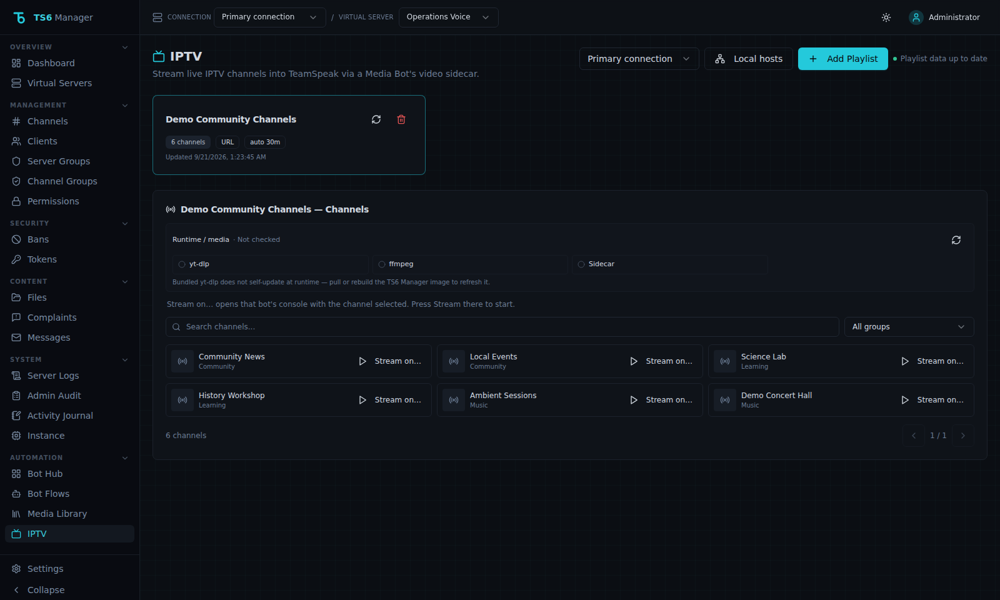

# Video streaming

TS6 Manager includes a Go/Pion media sidecar for low-latency video delivery to TeamSpeak clients and the browser preview.

## Supported inputs

The streaming path can accept supported YouTube, Twitch, direct media URLs, and IPTV sources.

- **YouTube** is downloaded with yt-dlp to a short-lived file under the music directory (avoids googlevideo 403s from datacenter IPs), then encoded.
- **Twitch** (live or VOD) is resolved with yt-dlp to a direct media URL and fed to ffmpeg — it is not downloaded to a `.stream-*.mp4` temp file (live Twitch cannot finish that path).

## Quality

Pick **Auto** or a fixed preset: 480p, 720p, 1080p, 1440p or 2160p.

- **Auto** probes the source with `ffprobe` and uses the largest preset the source fits without upscaling, up to the **Auto limit** (default 1080p). A 720p channel stays 720p even when the limit is 2160p. If the probe fails, Auto uses 720p (or the limit, if lower) and says so.
- **Fixed presets** skip the probe. Prefer them for IPTV services that allow only one connection, since the probe is a second one.
- The stream panel shows *requested → actual*, e.g. `Auto → 1080p (source 1920×1080)`.
- Leave the bitrate empty to use the preset's bitrate. Admins can set a **bitrate limit** that clamps every stream.
- Every stream is capped at **9500 kbps**, whatever the preset, custom bitrate or limit says: TeamSpeak drops a stream above 10 Mbit/s, which would look like an encoder failure. 2160p therefore uses 9500 kbps.
- Software VP8 and VP9 are held at the target bitrate (`-minrate`); without it libvpx overshoots on detailed video.

1440p and 2160p need a fast CPU with software encoders; a hardware encoder is recommended.

## Encoders

| Encoder | Codec | Notes |
|---|---|---|
| VP8 (software) | VP8 | Default; `libvpx` realtime |
| VP9 (software) | VP9 | `libvpx-vp9` realtime |
| H.264 (software) | H.264 | `libx264`, offered as **Constrained High** — the only H.264 profile the TeamSpeak client renders |
| VP8 / VP9 / H.264 (VAAPI) | same | GPU encode through VAAPI; H.264 uses Constrained High as well |

**Auto** uses software VP8, unless *Auto prefers hardware* is enabled: then it uses the first VAAPI encoder (H.264, then VP9, then VP8) that passed the sidecar's test encode.

If a hardware encoder cannot open the device or exits during startup, the sidecar restarts with the software encoder **of the same codec** (so connected viewers keep working) and the stream panel shows the fallback and its reason. Use **Check encoders** under *Streaming defaults* to run the test encodes on demand; routine status polling never runs them.

### Enabling VAAPI (Intel / AMD GPUs)

1. Pass the render node through to the sidecar container, for example in `docker-compose.yml`:

   ```yaml
   sidecar:
     devices:
       - /dev/dri:/dev/dri
   ```

2. The sidecar and all-in-one images include Mesa's VAAPI driver (`mesa-va-drivers`, AMD and older Intel) and, on amd64, Intel's `intel-media-va-driver`. For the all-in-one image, pass `/dev/dri` to that container instead.
3. Open *Streaming defaults* → **Check encoders** and confirm the VAAPI rows pass. Set `VAAPI_DEVICE` if your render node is not `/dev/dri/renderD128`.
4. Optionally set `VIDEO_HW_DECODE=1` to decode on the GPU too.

NVENC is not supported yet.

## Source type and stream health

Every stream has a source type:

| Type | Used for | Behaviour |
|---|---|---|
| **Live** | IPTV channels (default), live URLs | never loops; if it stops, the stream stops as *source unreachable* |
| **On demand** | remote videos | paced playback; stops as *source ended* when it finishes |
| **Local file** | files under the music directory, downloaded clips | paced; admin backgrounds loop |

**Detect** (the default for URLs) uses the Auto-quality probe: a source without a duration is live. The URL itself (for example `.m3u8`) is never used to guess, because IPTV providers often use opaque URLs. With a fixed preset there is no probe, so a URL is treated as on demand unless you pick **Live**.

While a stream runs, the backend samples the sidecar's encode stats every 10 seconds (in-memory counters, not a diagnostic probe). The stream panel and Bot Hub show the source type and encode speed (for example `1.01x · 30 fps`). If encoding stays below 0.9x for 20 seconds after a 15-second startup grace, a warning names the speed, dropped packets, preset, encoder and source type — for example *Encoding below realtime (0.62x for 40 s) at 1080p with VP8 (software) from a live source*. Use a lower preset or a hardware encoder.

If ffmpeg stops on its own, the stream stops instead of showing a frozen picture, with a reason: *source ended*, *source unreachable* (network/HTTP errors, or a live source ending), or *encoder failure*.

### Live pacing (issue #72)

Live inputs are read with `-re` like everything else. Measured on a 4-core host with the sidecar's 720p30 VP8 pipeline against live HLS (MPEG-TS) and CMAF (fMP4 with a `moov` repeated in every segment): `-re` held a steady ~1.01x at 30 fps, while reading without it burst to ~2x at startup (the buffered live-edge segments) before settling. The `Found duplicated MOOV Atom. Skipped it` messages from such CMAF sources were harmless in that test. Sustained ~0.5x therefore points at host encode capacity (or a provider-specific timestamp problem), which the health warning now makes visible. Set `VIDEO_LIVE_PACING=source` on the sidecar to let live sources set their own pace instead.

## One media session at a time

- A bot plays **music or video, never both**.
- Only **one video stream** runs at a time across all bots, because they share the media sidecar.

Starting something that would replace what is playing asks for confirmation first ("Replace what is playing?"), listing exactly what will stop. The server only replaces the sessions you confirmed, so double clicks, two admins, or a chat command racing a UI click cannot silently stop each other's media. Something that is still *starting* cannot be replaced — wait for it to finish, then try again.

Chat commands are explicit requests on one bot: `!play` on a bot that is streaming video stops that bot's stream, and `!stream` / `!tv` stop that bot's music. A chat command never stops another bot's stream.

The stop reason says what happened, for example *Replaced by music* or *Replaced by a stream on Bravo*.

### When TeamSpeak refuses or throttles the bot

- If TeamSpeak refuses to start a stream, the start fails at once with the server's reason, for example *TeamSpeak refused the stream: insufficient client permissions (error 2568)*. It no longer waits out a silent 10-second timeout.
- If the server's anti-flood protection blocks the bot (error 524, *client is flooding*), the bot stops sending chat replies and ignores chat commands for 30 seconds. Each further 524 restarts the 30 seconds, because every command sent while blocked extends the block. Once the hold ends, the bot says once in the channel that commands came in too fast. To exempt the bot entirely, grant its identity `b_client_ignore_antiflood` in TeamSpeak.
- A bot that TeamSpeak turns away because the server is full, the server password is wrong or the bot is banned stops at once with that reason, instead of retrying.

## Stopping and stop reasons

A stream stops on its own when:

- **nobody watches it** — no TeamSpeak client has had it open for the no-viewer timeout (default 5 minutes; Off, 1, 5, 10, 30 minutes or custom). While it counts down, the stream panel shows **Auto-stop in m:ss**. The browser preview does not count as a viewer. Each stream can override the timeout without changing the saved default;
- **the bot's channel is empty** for `BOT_AUTO_STOP_EMPTY_SECONDS` (separate setting);
- **a downloaded clip ends**.

After a stream stops, the tab shows the last reason, for example *Last stream: Stopped after 5 minutes with no viewers · 8 min ago*.

## IPTV playlists

The IPTV page manages M3U/M3U8 playlist sources for the selected server. Administrators can add a source as either a **remote playlist URL** or an **uploaded playlist file** (`.m3u`, `.m3u8`, or `.txt` with valid M3U content), then refresh, replace (uploads), or delete it; browse or search its parsed channels; filter by group; choose a running music bot and quality preset; then start or stop that channel's stream.

### URL vs uploaded source

| Source | Refresh | Auto-refresh | Storage |
|--------|---------|--------------|---------|
| Playlist URL | Re-fetches over HTTP(S) | Optional (minutes) | URL only in the database |
| Uploaded file | Re-reads/re-parses the stored file | Off by default (file does not change on its own) | File under backend `data/iptv/` + metadata in the database |

Uploaded sources are stored as application assets on the backend data volume (not TeamSpeak channel file storage). A full restore of uploaded playlists needs both the database and the `backend-data` volume. XMLTV/EPG upload, Xtream credential forms, and source export remain separate follow-ups.



### Playlists and channels on your local network

For safety, ts6-manager refuses links to private addresses (`192.168.x.x`, `10.x.x.x` and so on), so a pasted link cannot make the server reach devices on your network. That also blocks an IPTV proxy running at home, such as Threadfin, xTeVe, TVHeadend or a router's IPTV service.

Admins can allow those hosts under **IPTV → Local network sources**. Enter one per line: an IP (`192.168.1.20`), a range (`192.168.1.0/24`) or a hostname (`threadfin.lan`).

- The allowance covers IPTV only: playlist refreshes, channels started from the IPTV page, and `!tv <name>`. With `!tv`, users pick a channel name from your playlist, never a URL.
- Links typed in chat (`!stream`, `!play`), the video URL box and flow HTTP nodes stay blocked from private addresses.
- Loopback (`127.0.0.1`), link-local and cloud metadata addresses can never be allowed. Inside a container, loopback is the container itself, so use the host's LAN address instead.
- Each redirect of a playlist URL is checked again, so a playlist refresh cannot be redirected away from the allowed hosts.
- Streams get the same rules at every step. The sidecar sends each connection its ffmpeg makes (redirects, HLS playlists and segments, https) through a local checking proxy, which refuses private addresses not on this list and always refuses loopback, link-local and metadata addresses. The *Auto* quality probe of a URL runs in the sidecar through the same checks. A refused connection appears in the sidecar log as `[Egress] Blocked connection` with the host name only.
- The list is empty by default, and changing it is recorded in the audit log.

## Architecture

The backend coordinates media preparation and session state. The Go sidecar handles the WebRTC/media relay.

In the standard split-stack compose file:

- the sidecar listens on port 9800 inside the Docker network;
- port 9800 is **not** published to the host;
- browser WebRTC media uses a separate UDP path (not the HTTP sidecar port);
- set `WEBRTC_UDP_PORT` (and publish that UDP port bound to `WEBRTC_BIND_IP`) plus an IPv4 `WEBRTC_NAT1TO1_IP` when the browser is outside the Docker network — `docker-compose.pr-test.yml` enables UDP `10000` on `127.0.0.1` with advertise IP `127.0.0.1` by default;
- backend-to-sidecar mutating requests use `SIDECAR_SECRET`; and
- the backend and sidecar share the media volume.

The all-in-one image keeps the backend and sidecar on loopback behind nginx. For browser preview from outside that container, publish the same WebRTC UDP mux port and set `WEBRTC_NAT1TO1_IP` (see commented mappings in `docker-compose.all-in-one.yml`).

## Synchronization

The sidecar uses RTCP Sender Reports and adaptive pacing controls for A/V synchronization. Environment variables allow limited tuning of playout buffering, bias, queue sizes, bitrate, and encoder behavior.

See [Environment variables](environment-variables.md) for the available sidecar settings.

## Operational notes

Do not expose the sidecar directly to the public network.

If a stream does not start, check:

1. the backend can reach `SIDECAR_URL`, and the sidecar image is the same release as the backend (an older sidecar ignores encoder selection and always sends VP8 — the stream panel says so);
2. backend and sidecar use the same `SIDECAR_SECRET`;
3. the media volume is mounted at the same path in both containers; and
4. the source URL is still available to yt-dlp/FFmpeg.

Use the Runtime / media strip beside Video streaming or IPTV controls (Refresh) for a bounded on-demand sidecar and tool probe. Routine music-bot status polling does not call the sidecar health endpoint.

See [Troubleshooting](troubleshooting.md) for common deployment checks.
